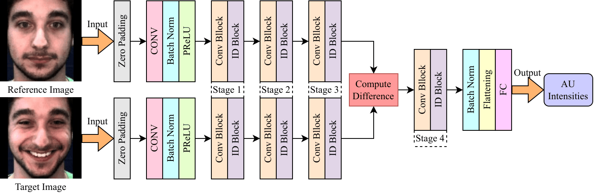

# One-Frame Calibration with Siamese Network in Facial Action Unit Recognition
<div align="center">
    
</div>

<div align="center">
   <strong>The architecture of the proposed CSN-IR50 network</strong>
</div>

<br><br>

Automatic facial action unit (AU) recognition is used widely in facial expression analysis. Most existing AU recognition systems aim for cross-participant non-calibrated generalization (NCG) to unseen faces without further calibration. However, due to the diversity of facial attributes across different identities, accurately inferring AU activation from single images of an unseen face is sometimes infeasible, even for human experts---it is crucial to first understand how the face appears in its neutral expression, or significant bias may be incurred. Therefore, we propose to perform one-frame calibration (OFC) in AU recognition: for each face, a single image of its neutral expression is used as the reference image for calibration. With this strategy, we develop a Calibrating Siamese Network (CSN) for AU recognition and demonstrate its remarkable effectiveness with a simple iResNet-50 (IR50) backbone. On the DISFA, DISFA+, and UNBC-McMaster datasets, we show that our OFC CSN-IR50 model (a) substantially improves the performance of IR50 by mitigating facial attribute biases (including biases due to wrinkles, eyebrow positions, facial hair, etc.), (b) substantially outperforms the naive OFC method of baseline subtraction as well as (c) a fine-tuned version of this naive OFC method, and (d) also outperforms state-of-the-art NCG models for both AU intensity estimation and AU detection.

# Getting Started
## Dependencies
The primary dependencies include NumPy, pandas, Matplotlib, OpenCV, MediaPipe, PyTorch, and Torchvision.

## AU Datasets
The datasets for training the AU models [DISFA](http://mohammadmahoor.com/disfa/), [DISFA+](http://mohammadmahoor.com/disfa/), and [UNBC-McMaster](https://sites.pitt.edu/~emotion/um-spread.htm) are supposed to be stored at "../FER_datasets/DISFA" and "../FER_datasets/DISFAPlus" respectively (paths specificed in config/datasets..py).

## Pretrained Models
Multiple pretrained models are used in our model training and analysis. They need to be downloaded from the following links and stored in the "pretrained_models" folder.

The face recognition model used as the pretrained model to fine-tune for training the AU recognition model can be downloaded [here](https://onedrive.live.com/?authkey=%21AFZjr283nwZHqbA&cid=4A83B6B633B029CC&id=4A83B6B633B029CC%215650&parId=4A83B6B633B029CC%215581&o=OneUp). The download link is provided in the [github repository of InsightFace](https://github.com/deepinsight/insightface/tree/master/recognition/arcface_torch#model-zoo). It is supposed to be renamed as "glint360k_cosface_r50_fp16_0.1.pth" and stored in the "pretrained_models" folder after being downloaded.

The face detection model can be downloaded [here](https://storage.googleapis.com/mediapipe-models/face_detector/blaze_face_short_range/float16/latest/blaze_face_short_range.tflite). The download link is provided in the [official document of MediaPipe](https://developers.google.com/mediapipe/solutions/vision/face_detector).

The facial landmark detection model can be downloaded [here](https://drive.google.com/file/d/1T8J73UTcB25BEJ_ObAJczCkyGKW5VaeY/view). The download link is provided in the [github repository of pytorch_face_landmark](https://github.com/cunjian/pytorch_face_landmark).

## AU Datasets Preprocessing
Run preprocess_DISFA.py, preprocess_DISFAPlus.py, and preprocess_UNBCMcMaster for preprocessing the AU datasets.

## Model Training and Evaluation
Training and evaluation are performed using Python scripts named in the format `<dataset>_AU_<task>_<cross-validation>_<model>.py`, covering DISFA, DISFA+, and UNBC-McMaster; AU intensity estimation and detection; and the IR50 and CSN-IR50 models. Run a script from the repository root using, for example, `python DISFA_AU_intensity_estimation_threefold_IR50.py --epochs 3 --batch_size 64 --gpu 0 --save_interval 1`. For CSN-IR50 scripts, additionally specify the feature-map merge location, e.g., `--merge_locs stage4`. Each script automatically runs all cross-validation folds and saves the trained models, metrics, and predictions under the `results` directory.

## Result Analysis
Run result_analysis.ipynb for analyzing and presenting the results.

## Case Examples

Run case_examples.ipynb for visualizing the case examples. The visualizations are saved in the "figures" folder.

## Citation

```
@article{feng2024one,
  title={One-Frame Calibration with Siamese Network in Facial Action Unit Recognition},
  author={Feng, Shuangquan and de Sa, Virginia R},
  journal={arXiv preprint arXiv:2409.00240},
  year={2024}
}
```